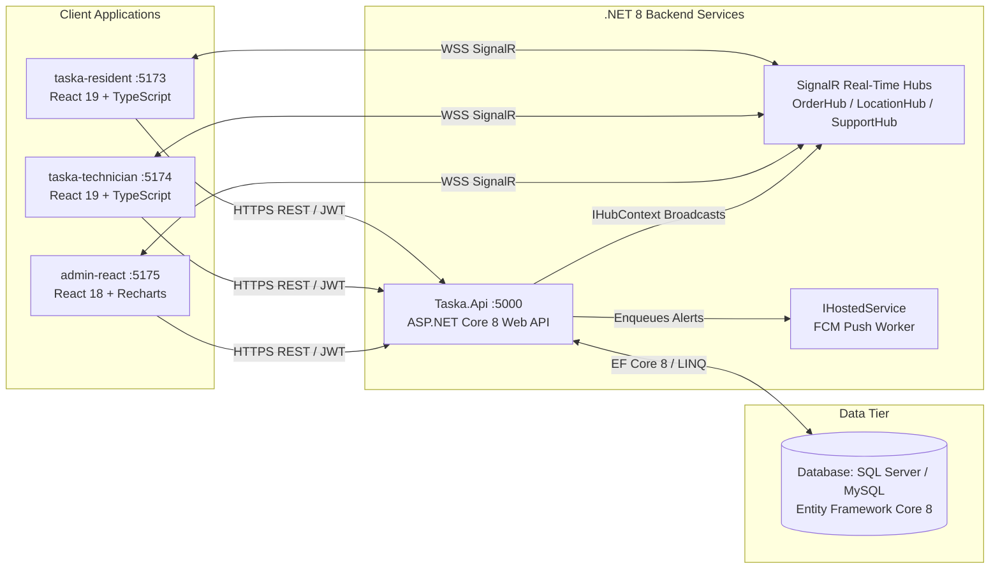
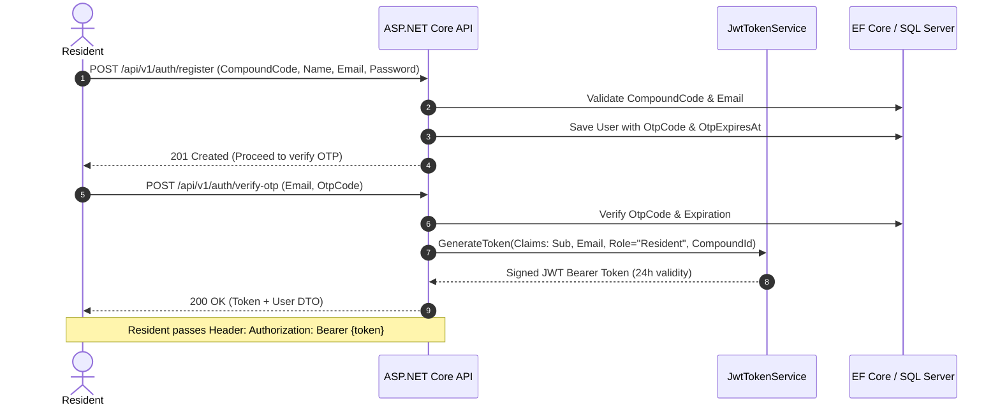
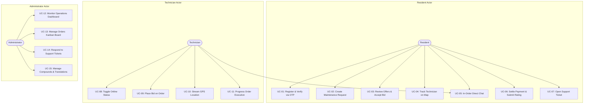

# Software Requirements Specification (SRS)
## Taska — Intelligent Compound Maintenance & Home Services Platform
### Enterprise .NET 8 & ASP.NET Core Architecture

**Document Reference:** `TASKA-SRS-NET8-V1.0`  
**Document Status:** Approved / Final Academic Submission  
**Target Platform:** .NET 8 / C# 12 / ASP.NET Core Web API / SignalR / EF Core 8  

---

## Table of Contents
1. [Introduction](#1-introduction)
   - 1.1 Purpose
   - 1.2 Scope
   - 1.3 Product Overview
   - 1.4 Intended Users & Audience
2. [System Overview](#2-system-overview)
3. [Stakeholders Analysis](#3-stakeholders-analysis)
4. [User Roles & Permissions Matrix](#4-user-roles--permissions-matrix)
5. [Functional Requirements](#5-functional-requirements)
6. [Non-Functional Requirements](#6-non-functional-requirements)
7. [System Architecture (.NET 8 Clean Architecture)](#7-system-architecture-net-8-clean-architecture)
8. [Technology Stack Inventory](#8-technology-stack-inventory)
9. [Database Requirements & Data Dictionary (EF Core 8)](#9-database-requirements--data-dictionary-ef-core-8)
10. [API Requirements & Interface Specifications](#10-api-requirements--interface-specifications)
11. [Authentication & Authorization Model (JWT Bearer)](#11-authentication--authorization-model-jwt-bearer)
12. [Business Rules](#12-business-rules)
13. [User Stories](#13-user-stories)
14. [Use Case Analysis & Diagrams](#14-use-case-analysis--diagrams)
15. [Use Case Detailed Specifications](#15-use-case-detailed-specifications)
16. [System Assumptions & Constraints](#16-system-assumptions--constraints)
17. [System Acceptance Criteria](#17-system-acceptance-criteria)
18. [Future Improvements & Extensibility Roadmap](#18-future-improvements--extensibility-roadmap)

---

## 1. Introduction

### 1.1 Purpose
The purpose of this Software Requirements Specification (SRS) is to establish the formal, definitive technical specification for the **Taska** on-demand home maintenance platform under an enterprise **.NET 8 (C# 12) / ASP.NET Core Web API** backend ecosystem. This specification defines all functional and non-functional requirements, Entity Framework Core schemas, SignalR real-time hubs, API contracts, security policies, and domain logic for university evaluation and software engineering audit.

### 1.2 Scope
**Taska** provides a closed-loop maintenance dispatch marketplace tailored exclusively for gated residential compounds (e.g., Palm Hills October, Mountain View iCity, Sodic West). Due to private residential community security gates, arbitrary external contractors are barred from entry. Taska establishes a compound-enclosed platform connecting verified on-premise technicians, verified residents, and property administrators via:
- Multi-party onboarding verified by compound authorization codes and email OTP validation.
- An on-demand service catalog across 5 specialized maintenance trades (Electricity, Plumbing, Air Conditioning, Gas, Carpentry).
- An interactive reverse bidding engine where compound technicians bid on customer requests.
- Real-time GPS movement tracking of technicians using HTML5 Geolocation and Google Maps DirectionsRenderer.
- Bi-directional, sub-second real-time messaging powered natively by **ASP.NET Core SignalR**.
- Automated billing settlement supporting simulated cash and card methods.
- Real-time administrative oversight through an interactive drag-and-drop Kanban dispatch board.

### 1.3 Product Overview
The platform couples an **ASP.NET Core 8 Web API** backend with modern **React (TypeScript & Vite)** client interfaces. Real-time events, order updates, technician GPS positions, and customer support sessions are handled via dedicated **SignalR Hubs**, eliminating third-party broadcasting overhead.

### 1.4 Intended Users & Audience
- **Resident Homeowners:** Residents in gated compounds booking verified maintenance.
- **Compound Technicians:** Stationed field specialists executing maintenance orders.
- **Compound Administrators / Facility Managers:** Operators auditing job completion, finance, and quality.
- **University Examination Committee:** Technical evaluators assessing software engineering discipline, .NET architectural patterns, and design consistency.

---

## 2. System Overview



---

## 3. Stakeholders Analysis

| Stakeholder Group | Description | Primary Interest | System Impact |
| :--- | :--- | :--- | :--- |
| **Compound Residents** | Residents and tenants of gated communities. | Vetted, rapid, and transparent home repairs from authorized staff. | High (Consumers of service). |
| **Field Technicians** | Compound-stationed electricians, plumbers, HVAC technicians. | Real-time job discovery, fair reverse bidding, GPS route guidance. | High (Service providers). |
| **Compound Security & Facility Boards** | Community property management authorities. | Enforcing contractor verification at community gates. | High (Governance). |
| **System Administrators** | Central operations and finance controllers. | Real-time Kanban dispatching, revenue audits, and dispute resolution. | Critical (System operators). |

---

## 4. User Roles & Permissions Matrix

The system implements Role-Based Access Control (RBAC) via ASP.NET Core JWT claims:

| Feature / Resource | Resident (`Role="Resident"`) | Technician (`Role="Technician"`) | Admin (`Role="Admin"`) |
| :--- | :---: | :---: | :---: |
| Register with Compound Code & OTP | **Yes** | No (Provisioned by Admin) | No (Seeded) |
| Login with JWT Bearer Token | **Yes** | **Yes** | **Yes** |
| Browse Categories & Base Rates | **Yes** | **Yes** | **Yes** |
| Create Service Order | **Yes** (Max 1 active) | No | No |
| Cancel Order | **Yes** (Prior to completion) | No | **Yes** |
| Submit Reverse Price Bid | No | **Yes** (Pending orders in compound) | No |
| Accept Technician Bid | **Yes** | No | No |
| Accept Order at Base Price | No | **Yes** (Pending orders in compound) | No |
| Stream Live GPS Location to SignalR | No | **Yes** (Active order) | No |
| Progress Job Lifecycle (`arrived`, `in_progress`, `completed`) | No | **Yes** (Assigned order) | No |
| Pay Invoice (Cash / Visa Simulation) | **Yes** | No | No |
| Submit 5-Star Rating & Review | **Yes** | No | No |
| In-Order Direct Chat (SignalR) | **Yes** (Own order) | **Yes** (Assigned order) | No |
| Open Customer Support Ticket | **Yes** (Max 1 active) | No | No |
| Executive Dashboard & Recharts KPIs | No | No | **Yes** |
| Real-Time Drag-and-Drop Orders Kanban | No | No | **Yes** |
| Manage Compounds, Categories, Technicians | No | No | **Yes** |
| Issue Financial Transaction Refunds | No | No | **Yes** |
| Manage Bilingual Translations | No | No | **Yes** |

---

## 5. Functional Requirements

### 5.1 Authentication & Compound Verification

#### `FR-AUTH-01`: Resident Registration & Compound Verification
- **Description:** Residents register with Full Name, Email, Phone, Apartment Code, Password, and a mandatory Compound Code (e.g. `PHO01`). The system validates the compound code against the database, generates a 6-digit numeric OTP with 10-minute expiry, and dispatches an email.
- **Preconditions:** Resident has a valid compound authorization code.
- **Main Flow:**
  1. Client sends registration request to `POST /api/v1/auth/register`.
  2. `AuthService` verifies compound code exists and is active.
  3. Hashes password using `BCrypt.Net`.
  4. Generates random 6-digit OTP stored with `OtpExpiresAt = DateTime.UtcNow.AddMinutes(10)`.
  5. Queues background email via SMTP.
  6. Returns `201 Created`.
- **Alternative Flow:** Invalid compound code returns `400 Bad Request` (`"Invalid compound code"`).

#### `FR-AUTH-02`: Email OTP Verification & JWT Token Issuance
- **Description:** Resident enters the 6-digit code to verify their identity and obtain an ASP.NET Core JWT Bearer token.
- **Main Flow:**
  1. Client posts Email and `OtpCode` to `POST /api/v1/auth/verify-otp`.
  2. System verifies OTP code and checks expiration (`DateTime.UtcNow <= user.OtpExpiresAt`).
  3. Clears OTP fields.
  4. Generates JWT signed with 256-bit symmetric security key containing claims: `Sub`, `Email`, `Role = "Resident"`, `CompoundId`.
  5. Returns token and user payload.

#### `FR-AUTH-03`: Technician Multi-Identifier Login
- **Description:** Technicians log in using either registered phone number or email address along with password.
- **Main Flow:**
  1. Posts `identifier` and `password` to `POST /api/v1/auth/technician/login`.
  2. `AuthService` resolves technician by Phone or Email and verifies BCrypt hash.
  3. Issues JWT with claim `Role = "Technician"`.

---

### 5.2 Maintenance Orders & Reverse Bidding

#### `FR-ORD-01`: Maintenance Request Creation with Mutex Guard
- **Description:** Residents create a service order specifying trade category, fault description, photo upload, map coordinates, urgency, and payment choice.
- **Preconditions:** Resident must NOT have an ongoing order (`pending`, `accepted`, `arrived`, `in_progress`).
- **Main Flow:**
  1. Client posts to `POST /api/v1/user/orders`.
  2. Enforces single active order rule via `OrderService`.
  3. Saves uploaded image to disk.
  4. Creates order record with status `pending`.
  5. Logs initial state in `OrderStatusHistories`.
  6. Broadcasts `NewOrderAvailable` event to `CompoundHub` (`/hubs/compound`).
  7. Enqueues FCM push notification to all online compound technicians.

#### `FR-ORD-02`: Technician Reverse Bidding
- **Description:** Online compound technicians review pending orders and submit custom price quotes with notes.
- **Main Flow:**
  1. Technician posts `Amount` and optional `Notes` to `POST /api/v1/technician/orders/{id}/bid`.
  2. Validates order status is `pending`.
  3. Creates or updates `OrderBid` (enforcing one bid per technician).
  4. Broadcasts `NewBidReceived` over `OrderHub` to the resident.
  5. Dispatches FCM push notification: `"New Offer Received 💰"`.

#### `FR-ORD-03`: Bid Acceptance & Competitor Dismissal
- **Description:** Resident reviews offers and accepts one bid.
- **Main Flow:**
  1. Resident calls `POST /api/v1/user/orders/{id}/bids/{bidId}/accept`.
  2. Inside an EF Core transaction (`BeginTransactionAsync`):
     - Sets winning bid status to `accepted`.
     - Sets all other bids for this order to `rejected`.
     - Assigns order `TechnicianId`, sets `TotalPrice = bid.Amount`, status to `accepted`, `AcceptedAt = DateTime.UtcNow`.
     - Appends log to `OrderStatusHistories`.
  3. Broadcasts `OrderAccepted` over `OrderHub` to both resident and winning technician.

---

### 5.3 Live GPS Tracking & Job Execution

#### `FR-TRACK-01`: Real-Time GPS Location Streaming via SignalR
- **Description:** Active technician device streams GPS coordinates (`lat`, `lng`, `speed`, `heading`) captured via `navigator.geolocation.watchPosition`.
- **Main Flow:**
  1. Technician client pushes coordinates to `LocationHub` or `POST /api/v1/technician/location`.
  2. Updates `Technician.Lat` and `Technician.Lng`.
  3. Inserts entry into `TechnicianLocationLogs`.
  4. `LocationHub` broadcasts `TechnicianLocationUpdated` to the order group `order-{orderId}`.
  5. Resident Google Maps view updates vehicle marker smoothly and recalculates ETA.

#### `FR-TRACK-02`: Sequential Job State Transitions
- **Description:** Technician advances order status: `accepted` → `arrived` → `in_progress` → `completed`.
- **Main Flow:**
  1. Technician posts new status to `POST /api/v1/technician/orders/{id}/status`.
  2. `OrderService` validates valid transitions.
  3. Updates timestamps (`ArrivedAt`, `CompletedAt`).
  4. On `completed`, increments technician's `CompletedOrders` and automatically generates pending `Payment` record.
  5. Emits `OrderStatusUpdated` over `OrderHub` and `admin.orders` channel.

---

### 5.4 In-Order Chat & Support Helpdesk

#### `FR-MSG-01`: In-Order Live Messaging via SignalR
- **Description:** Real-time chat between resident and technician within an active order.
- **Main Flow:**
  1. Client sends message via `OrderHub.SendMessage(orderId, message)`.
  2. Verifies sender belongs to the order.
  3. Persists record in `ChatMessages`.
  4. Broadcasts `ReceiveChatMessage` to the order group in SignalR.

#### `FR-SUPP-01`: Resident Support Helpdesk Widget
- **Description:** Floating widget for resident support cases, linked to order if applicable.
- **Main Flow:**
  1. Resident submits ticket via `POST /api/v1/user/support/tickets`.
  2. Enforces single open ticket rule.
  3. Broadcasts `NewSupportTicket` to administrators over `SupportHub`.
  4. Admin and resident exchange messages live; closing ticket triggers resident satisfaction rating dialog.

---

### 5.5 Invoicing, Ratings & Admin Operations

#### `FR-PAY-01`: Automated Billing & Payment Processing
- **Description:** Settles completed orders via Cash or simulated Visa card.
- **Main Flow:**
  1. Resident posts payment method to `POST /api/v1/user/orders/{id}/pay`.
  2. *Cash:* Generates `CASH-{UUID}`, marks status `paid`.
  3. *Visa:* Validates card inputs, simulates gateway (declines cards ending in `0000`), generates `VISA-{UUID}`.
  4. Admin can issue refunds via `POST /api/v1/admin/payments/{id}/refund`.

#### `FR-RATE-01`: Customer 5-Star Rating Engine
- **Description:** Post-service rating submission updating technician reputation.
- **Main Flow:**
  1. Resident posts 1–5 stars and comment to `POST /api/v1/user/orders/{id}/rate`.
  2. Saves record in `Ratings`.
  3. Recalculates technician's arithmetic mean rating rounded to 2 decimal places.

#### `FR-ADM-01`: Drag-and-Drop Live Orders Kanban Board
- **Description:** Admin console provides `OrdersBoard.jsx` displaying live columns: `Pending`, `Accepted`, `In Progress`, `Completed`.
- **Main Flow:**
  1. Loads orders and connects to `OrderHub`.
  2. Automatically moves order cards between columns upon SignalR status events.
  3. Admin can drag cards to manually update status and inspect full audit logs.

---

## 6. Non-Functional Requirements

- **NFR-PERF-01 (API Latency):** Core endpoints respond in under 150ms under typical compound load.
- **NFR-PERF-02 (SignalR Broadcast Latency):** Real-time hub events delivered to connected WebSocket clients in under 50ms.
- **NFR-SEC-01 (JWT Authentication):** Cryptographically signed JWT tokens with claims validation and expiry.
- **NFR-SEC-02 (RBAC Policy Enforcement):** Strict policy attributes (`[Authorize(Roles = "...")]`) prevent cross-role access.
- **NFR-REL-01 (Atomic Transactions):** Critical state changes execute inside EF Core database transactions.
- **NFR-REL-02 (Offline Client Resilience):** Client frontends feature automatic sandbox fallback (`sandbox.ts`) when API is unreachable.
- **NFR-USA-01 (Bilingual Localization):** Full dynamic Arabic and English support with RTL/LTR layout mirroring.

---

## 7. System Architecture (.NET 8 Clean Architecture)

The backend follows an enterprise Clean Architecture design:

```
┌─────────────────────────────────────────────────────────────┐
│                    Presentation Layer                       │
│  taska-resident (Port 5173)   │ taska-technician (Port 5174)│
│  React 19, TS, Zustand        │ React 19, TS, Zustand       │
│  admin-react (Port 5175) - React 18, Recharts, Kanban Board │
└──────────────────────────────┬──────────────────────────────┘
                               │ HTTPS REST (JSON) / SignalR WebSockets
┌──────────────────────────────▼──────────────────────────────┐
│                    ASP.NET Core Web API                     │
│  Controllers/ (/api/v1)   │ Hubs/ (SignalR Real-Time)       │
│  Middlewares (Exception, JWT Authentication, CORS)          │
└──────────────────────────────┬──────────────────────────────┘
                               │
┌──────────────────────────────▼──────────────────────────────┐
│                  Application Services Layer                 │
│  AuthService     LocationService   OrderService             │
│  PaymentService  RatingService     FluentValidation         │
└──────────────────────────────┬──────────────────────────────┘
                               │
┌──────────────────────────────▼──────────────────────────────┐
│                   Domain Layer (Entities)                   │
│  Compound, User, Technician, ServiceCategory, Order,         │
│  OrderBid, OrderStatusHistory, Payment, Rating, Support...  │
└──────────────────────────────┬──────────────────────────────┘
                               │
┌──────────────────────────────▼──────────────────────────────┐
│                 Infrastructure & Persistence                │
│  EF Core 8 TaskaDbContext │ SQL Server / MySQL Database     │
│  BackgroundServices (FCM) │ BCrypt Password Hasher          │
└─────────────────────────────────────────────────────────────┘
```

---

## 8. Technology Stack Inventory

| Component | Technology | Version | Purpose |
| :--- | :--- | :--- | :--- |
| **Backend Framework** | ASP.NET Core Web API | .NET 8.0 (C# 12) | Enterprise REST API and Dependency Injection |
| **Data Access / ORM** | Entity Framework Core | 8.0 (`EF Core`) | Code-First migrations, LINQ, change tracking |
| **Real-Time Communication**| ASP.NET Core SignalR | 8.0 (`@microsoft/signalr`)| Native WebSocket hubs for real-time dispatch |
| **Authentication** | JWT Bearer Tokens | `Microsoft.AspNetCore.Authentication.JwtBearer` | Stateless, claims-based role security |
| **Database** | Microsoft SQL Server / MySQL | SQL Server 2022 / MySQL 8 | Relational data persistence and foreign keys |
| **API Documentation** | Swagger / OpenAPI | Swashbuckle 6.5 | Interactive API catalog and testing UI |
| **Validation** | FluentValidation | 11.0 | Strong request model validation rules |
| **Frontends** | React / TypeScript / Vite | React 18 & 19, TS 6.0, Vite 5.4 & 8.0 | Mobile web and administrative consoles |

---

## 9. Database Requirements & Data Dictionary (EF Core 8)

### C# Entity Definitions

#### 1. `Compound.cs`
```csharp
public class Compound
{
    public int Id { get; set; }
    [Required, MaxLength(255)]
    public string Name { get; set; } = string.Empty;
    [Required, MaxLength(50)]
    public string Code { get; set; } = string.Empty; // e.g., PHO01 (Unique)
    [Required]
    public string Address { get; set; } = string.Empty;
    public string? Phone { get; set; }
    public string? City { get; set; }
    public string? Logo { get; set; }
    public bool IsActive { get; set; } = true;
    public DateTime CreatedAt { get; set; } = DateTime.UtcNow;
    
    public ICollection<User> Users { get; set; } = new List<User>();
    public ICollection<Technician> Technicians { get; set; } = new List<Technician>();
}
```

#### 2. `User.cs` (Residents & Admins)
```csharp
public class User
{
    public int Id { get; set; }
    public int CompoundId { get; set; }
    public Compound Compound { get; set; } = null!;
    [Required, MaxLength(255)]
    public string Name { get; set; } = string.Empty;
    [Required, EmailAddress]
    public string Email { get; set; } = string.Empty; // Unique
    [Required]
    public string PasswordHash { get; set; } = string.Empty;
    [Required, Phone]
    public string Phone { get; set; } = string.Empty; // Unique
    [Required]
    public string ApartmentCode { get; set; } = string.Empty;
    [Required]
    public string Role { get; set; } = "Resident"; // Resident | Admin
    public string Language { get; set; } = "en";
    public string? OtpCode { get; set; }
    public DateTime? OtpExpiresAt { get; set; }
    public string? FcmToken { get; set; }
    public DateTime CreatedAt { get; set; } = DateTime.UtcNow;

    public ICollection<Order> Orders { get; set; } = new List<Order>();
}
```

#### 3. `Technician.cs`
```csharp
public class Technician
{
    public int Id { get; set; }
    public int CompoundId { get; set; }
    public Compound Compound { get; set; } = null!;
    public int? ServiceCategoryId { get; set; }
    public ServiceCategory? ServiceCategory { get; set; }
    [Required, MaxLength(255)]
    public string Name { get; set; } = string.Empty;
    public string? Email { get; set; }
    [Required]
    public string Phone { get; set; } = string.Empty; // Unique
    [Required]
    public string PasswordHash { get; set; } = string.Empty;
    public string Specialization { get; set; } = string.Empty;
    public string Status { get; set; } = "offline"; // online | offline
    public decimal Rating { get; set; } = 0.00m;
    public int TotalRatings { get; set; } = 0;
    public int CompletedOrders { get; set; } = 0;
    public decimal? Lat { get; set; }
    public decimal? Lng { get; set; }
    public string? FcmToken { get; set; }
    public string Language { get; set; } = "en";

    public ICollection<Order> Orders { get; set; } = new List<Order>();
    public ICollection<OrderBid> Bids { get; set; } = new List<OrderBid>();
}
```

#### 4. `Order.cs`
```csharp
public class Order
{
    public int Id { get; set; }
    public int UserId { get; set; }
    public User User { get; set; } = null!;
    public int? TechnicianId { get; set; }
    public Technician? Technician { get; set; }
    public int CategoryId { get; set; }
    public ServiceCategory Category { get; set; } = null!;
    [Required]
    public string Description { get; set; } = string.Empty;
    public string? Image { get; set; }
    public string Status { get; set; } = "pending"; // pending, accepted, arrived, in_progress, completed, cancelled
    public decimal? Lat { get; set; }
    public decimal? Lng { get; set; }
    public string PaymentMethod { get; set; } = "cash"; // cash | visa
    public decimal TotalPrice { get; set; }
    public string? CancellationReason { get; set; }
    public DateTime? AcceptedAt { get; set; }
    public DateTime? ArrivedAt { get; set; }
    public DateTime? CompletedAt { get; set; }
    public DateTime CreatedAt { get; set; } = DateTime.UtcNow;

    public Payment? Payment { get; set; }
    public Rating? Rating { get; set; }
    public ICollection<OrderBid> Bids { get; set; } = new List<OrderBid>();
    public ICollection<OrderStatusHistory> StatusHistories { get; set; } = new List<OrderStatusHistory>();
}
```

---

## 10. API Requirements & Interface Specifications

### Controller Architecture & SignalR Hub Routes

| Route | Protocol | Security Policy | Description |
| :--- | :---: | :--- | :--- |
| `POST /api/v1/auth/register` | HTTP POST | AllowAnonymous | Resident signup & OTP email dispatch |
| `POST /api/v1/auth/verify-otp` | HTTP POST | AllowAnonymous | Verify OTP and return JWT Bearer token |
| `POST /api/v1/auth/login` | HTTP POST | AllowAnonymous | Resident & Admin JWT authentication |
| `POST /api/v1/auth/technician/login`| HTTP POST | AllowAnonymous | Technician login by Phone/Email |
| `GET /api/v1/compounds` | HTTP GET | AllowAnonymous | List compounds and codes |
| `GET /api/v1/categories` | HTTP GET | AllowAnonymous | Service categories and base prices |
| `GET /api/v1/translations` | HTTP GET | AllowAnonymous | Bilingual dictionary by `?lang=code` |
| `GET /api/v1/user/orders` | HTTP GET | `[Authorize(Roles = "Resident")]` | History of resident maintenance orders |
| `POST /api/v1/user/orders` | HTTP POST | `[Authorize(Roles = "Resident")]` | Create maintenance order (enforces single active) |
| `POST /api/v1/user/orders/{id}/bids/{bidId}/accept` | HTTP POST | `[Authorize(Roles = "Resident")]` | Accept technician bid & lock order |
| `POST /api/v1/user/orders/{id}/pay` | HTTP POST | `[Authorize(Roles = "Resident")]` | Settle invoice (Cash or Visa) |
| `POST /api/v1/user/orders/{id}/rate` | HTTP POST | `[Authorize(Roles = "Resident")]` | Submit 5-star rating |
| `POST /api/v1/technician/toggle-status` | HTTP POST | `[Authorize(Roles = "Technician")]` | Toggle online/offline status |
| `POST /api/v1/technician/location` | HTTP POST | `[Authorize(Roles = "Technician")]` | Post live GPS coordinates |
| `POST /api/v1/technician/orders/{id}/bid` | HTTP POST | `[Authorize(Roles = "Technician")]` | Place reverse price bid |
| `POST /api/v1/technician/orders/{id}/status` | HTTP POST | `[Authorize(Roles = "Technician")]` | Progress order status (`arrived`, `in_progress`, `completed`) |
| `GET /api/v1/admin/dashboard` | HTTP GET | `[Authorize(Roles = "Admin")]` | Operational KPI metrics & charts |
| `GET /api/v1/admin/orders` | HTTP GET | `[Authorize(Roles = "Admin")]` | Full orders directory |
| `POST /api/v1/admin/payments/{id}/refund` | HTTP POST | `[Authorize(Roles = "Admin")]` | Issue financial refund |
| `/hubs/order` | SignalR WSS | Authorized JWT | Order lifecycle & chat hub |
| `/hubs/location` | SignalR WSS | Authorized JWT | Real-time vehicle GPS streaming hub |
| `/hubs/compound` | SignalR WSS | Authorized JWT | Compound job dispatch radar hub |
| `/hubs/support` | SignalR WSS | Authorized JWT | Customer care messaging hub |

---

## 11. Authentication & Authorization Model (JWT Bearer)



---

## 12. Business Rules

1. **BR-01 (Single Active Order Policy):** A resident cannot create a new maintenance request if they currently possess an ongoing order with status `pending`, `accepted`, `in_progress`, or `arrived`.
2. **BR-02 (Compound Boundary Restriction):** Technicians can only receive broadcasts, view requests, and place bids on orders originating from residents inside their assigned `CompoundId`.
3. **BR-03 (One Bid Per Technician):** A technician can only place one active bid per order. Subsequent bids update the existing bid amount and notes.
4. **BR-04 (Bid Acceptance Mutex):** When a resident accepts an offer, the order is locked to that technician and all competing bids are immediately marked `rejected`.
5. **BR-05 (Sequential State Progression):** An order cannot skip states. Legitimate forward transitions are:
   - `pending` → `accepted` → `arrived` → `in_progress` → `completed`.
6. **BR-06 (Automated Billing Trigger):** As soon as an order reaches `completed` status, a corresponding record is automatically created in `Payments` with the final agreed price.
7. **BR-07 (Rating Immutability):** An order can only be rated once. The rating must be an integer between 1 and 5 stars.
8. **BR-08 (Single Active Support Ticket):** A resident can only have one active support ticket with status `open` at any time.

---

## 13. User Stories

- **US-01:** As a *Resident*, I want to register using my compound code and apartment number so that only residents of my community can request home services.
- **US-02:** As a *Resident*, I want to describe my maintenance problem and attach a photo so that technicians understand the issue before arriving.
- **US-03:** As a *Resident*, I want to receive price bids from multiple verified compound technicians so that I can choose the best offer based on price and rating.
- **US-04:** As a *Resident*, I want to watch the technician's location moving in real-time on a map via SignalR so that I know their arrival time at my gate.
- **US-05:** As a *Technician*, I want to toggle my duty status to online so that I receive new job alerts when I am ready to work.
- **US-06:** As a *Technician*, I want to submit a price bid on requests so that I can price complex repairs appropriately.
- **US-07:** As a *Technician*, I want to update order progress (Arrived, Working, Completed) with one tap so that the resident and management are updated.
- **US-08:** As an *Administrator*, I want a live drag-and-drop Kanban board so that I can monitor all ongoing maintenance jobs across the compound without refreshing.

---

## 14. Use Case Analysis & Diagrams



---

## 15. Use Case Detailed Specifications

### Use Case `UC-03`: Review Offers & Accept Bid
- **Primary Actor:** Resident
- **Preconditions:** Resident has created an order; technicians have submitted bids.
- **Main Flow:**
  1. System displays list of bids showing technician name, rating, completed jobs, and price.
  2. Resident reviews offers and clicks "Accept Offer".
  3. Client issues `POST /api/v1/user/orders/{orderId}/bids/{bidId}/accept`.
  4. Backend assigns technician, updates price, rejects other bids, and broadcasts `OrderAccepted` over `OrderHub`.
  5. Client transitions resident to `/order-tracking`.

---

## 16. System Assumptions & Constraints

1. **Compound Enclosure Constraint:** System assumes services occur strictly within defined gated compound territories.
2. **Connectivity Assumption:** Assumes client devices have active internet access for SignalR WebSocket and REST communication. When disconnected, the client falls back to the local sandbox simulator.
3. **Map API Quota:** Google Maps rendering requires a valid Google Cloud API key loaded in `index.html`.
4. **Push Notification Prerequisite:** Firebase Cloud Messaging requires valid service account credentials for live production push.

---

## 17. System Acceptance Criteria

- **AC-01:** Resident registration rejects any request that fails compound code validation.
- **AC-02:** Email OTP must expire strictly after 10 minutes.
- **AC-03:** A resident with an ongoing order must be blocked from creating another order.
- **AC-04:** Only technicians in the same compound can view and bid on an order.
- **AC-05:** Accepting one technician's bid must atomically reject all competing bids.
- **AC-06:** Technician GPS coordinates must update the resident tracking map over SignalR within 1 second of broadcast.
- **AC-07:** Completing an order must generate a pending payment record and allow a 1–5 star rating submission.
- **AC-08:** Bilingual translation editor in Admin must immediately update client copy when reloaded.

---

## 18. Future Improvements & Extensibility Roadmap

1. **Compound Gate Security Pass (QR Code):** Automatically generate a time-limited digital gate pass QR code on `TechExecution.tsx` for compound security guards to scan before permitting entry.
2. **Audio Voice Notes in Chat:** Extend `ChatMessages` table to store audio file URLs recorded via browser MediaRecorder API for hands-free technician communication.
3. **Direct Electronic Payment Gateway Integration:** Replace the simulated Visa payment processing with live Paymob or Fawry payment gateway webhooks.
4. **Automated Preventive Maintenance Subscriptions:** Allow compound residents to schedule recurring HVAC filter replacements and plumbing inspections on a monthly or quarterly calendar.
