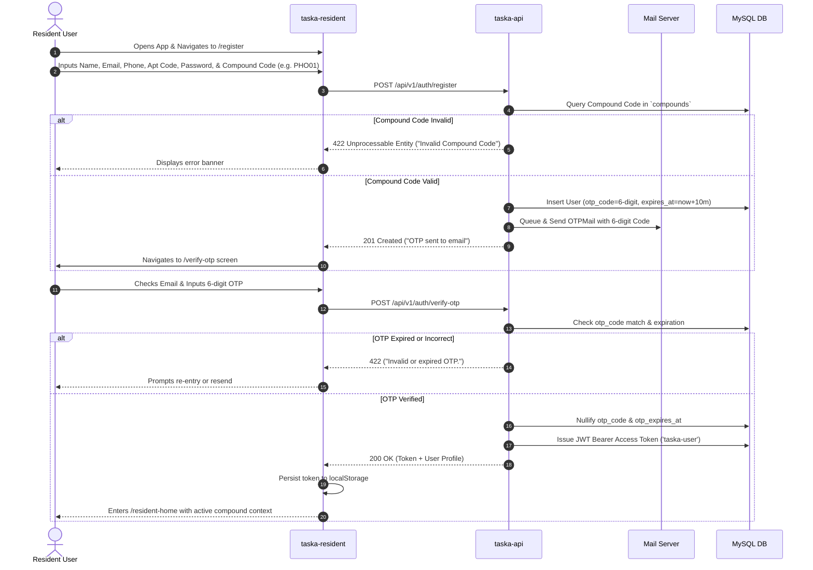
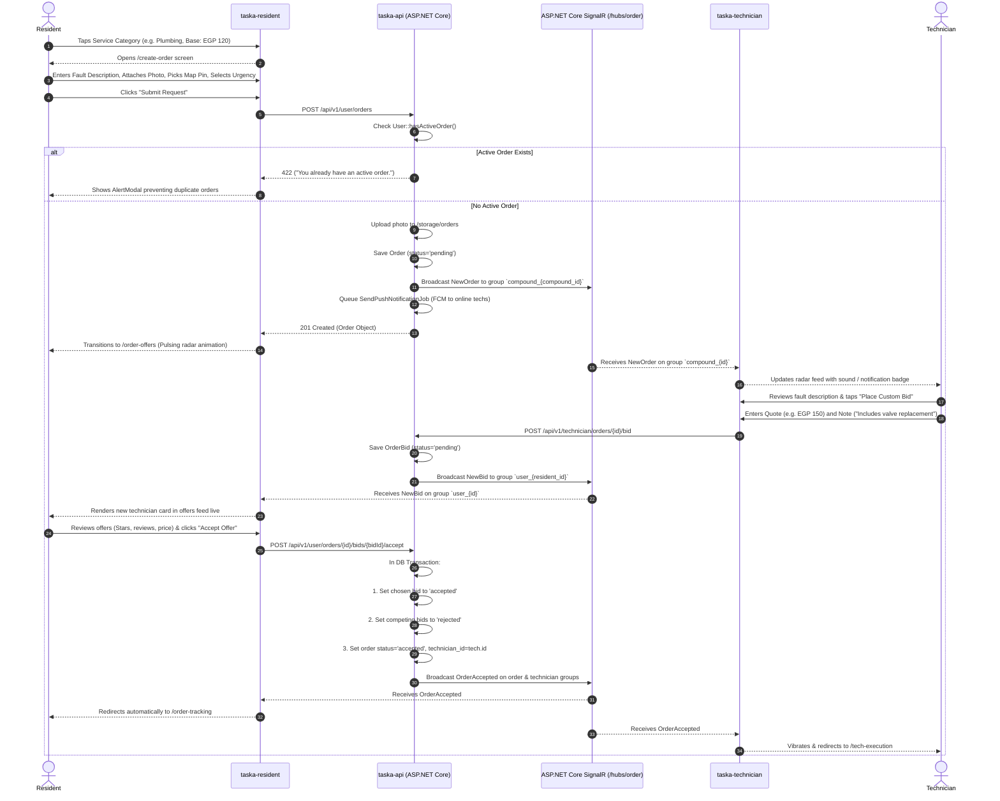
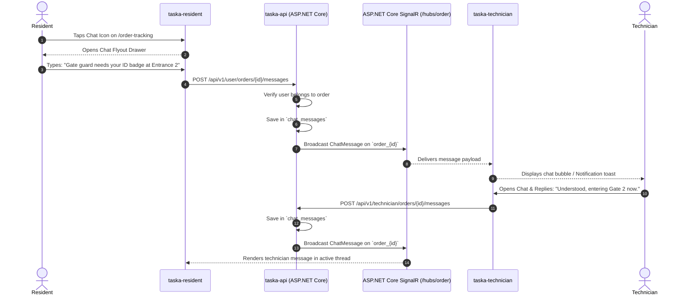
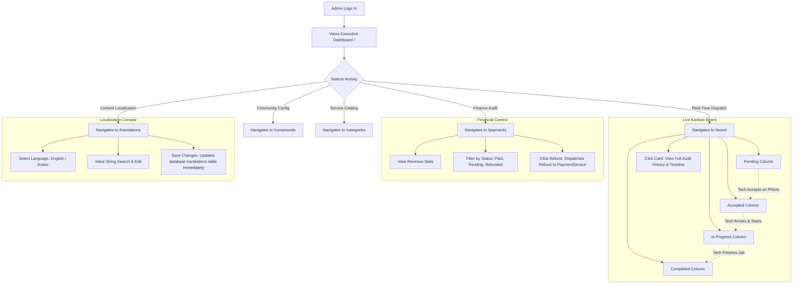

# Taska — User Flows & Interaction Journeys

This document details the step-by-step user interaction flows and system journeys across **Taska**, derived directly from the application code, route definitions, and WebSocket event sequences.

---

## 1. Primary User Journey Maps

### Journey 1: Resident Registration & Compound Verification Flow

This flow validates that only physical residents of authorized gated compounds can access the marketplace:



---

### Journey 2: Maintenance Request Creation & Bidding Marketplace Flow

This journey illustrates the reverse bidding model where compound technicians submit monetary offers on a resident's request:



---

### Journey 3: Real-Time GPS Tracking & Job Execution Lifecycle Flow

This flow tracks the physical movement and operational status progression from departure to job completion:

```mermaid
sequenceDiagram
    autonumber
    actor T as Technician
    participant TApp as taska-technician
    participant API as taska-api (ASP.NET Core)
    participant SignalR as ASP.NET Core SignalR (/hubs/location & /hubs/order)
    participant RApp as taska-resident
    actor R as Resident

    Note over TApp,API: Technician is En Route to Resident's Apartment
    loop Every 5 to 15 seconds / On Movement
        TApp->>TApp: Geolocation watchPosition() captures Lat, Lng
        TApp->>API: POST /api/v1/technician/location (lat, lng, speed, heading)
        API->>API: Update technicians table & log to technician_location_logs
        API->>SignalR: Broadcast LocationUpdated on `order_{id}`
        SignalR-->>RApp: Receives coordinates
        RApp->>RApp: Google Maps marker moves smoothly; updates distance & ETA
    end

    Note over T,TApp: Stage 1: Arrival at Gate / Door
    T->>TApp: Taps "I Have Arrived"
    TApp->>API: POST /api/v1/technician/orders/{id}/status (status='arrived')
    API->>API: Set status='arrived', arrived_at=now()
    API->>SignalR: Broadcast TechnicianArrived & OrderStatusUpdated
    SignalR-->>RApp: Shows green alert: "Technician has arrived at your door!"
    RApp-->>R: Stepper moves to "Arrived"

    Note over T,TApp: Stage 2: Service Execution
    T->>TApp: Taps "Start Working"
    TApp->>API: POST /api/v1/technician/orders/{id}/status (status='in_progress')
    API->>SignalR: Broadcast OrderStatusUpdated
    SignalR-->>RApp: Stepper moves to "In Progress"

    Note over T,TApp: Stage 3: Job Completion & Billing
    T->>TApp: Taps "Finish & Complete Job"
    TApp->>API: POST /api/v1/technician/orders/{id}/status (status='completed')
    API->>API: In DB Transaction:
    API->>API: 1. Set status='completed', completed_at=now()
    API->>API: 2. Increment technician.completed_orders
    API->>API: 3. Create pending Payment record
    API->>SignalR: Broadcast OrderCompleted on `order_{id}`
    SignalR-->>TApp: Shows Job Summary screen
    SignalR-->>RApp: Opens Payment Settlement Modal

    Note over R,RApp: Stage 4: Payment & Rating
    R->>RApp: Selects Payment Method (Cash or Visa Simulation)
    RApp->>API: POST /api/v1/user/orders/{id}/pay
    API->>API: Mark payment paid, generate transaction_id
    API-->>RApp: Payment confirmed
    RApp-->>R: Closes payment modal; opens 5-Star Rating Modal
    R->>RApp: Selects 5 Stars & Enters Comment
    RApp->>API: POST /api/v1/user/orders/{id}/rate
    API->>API: Insert rating, recalculate technician average rating
    API-->>RApp: Rating saved
    RApp-->>R: Navigates back to /resident-home
```

---

### Journey 4: In-Order Direct Real-Time Chat Flow



---

### Journey 5: Customer Support Helpdesk Journey

```mermaid
sequenceDiagram
    autonumber
    actor R as Resident
    participant RApp as taska-resident
    participant API as taska-api (ASP.NET Core)
    participant SignalR as ASP.NET Core SignalR (/hubs/support)
    participant AApp as admin-react
    actor Admin as Support Admin

    R->>RApp: Clicks Floating Support Widget Button
    RApp-->>R: Displays Support Form (Subject & Message)
    R->>RApp: Submits: "Technician arrived 20 minutes late and broke water valve"
    RApp->>API: POST /api/v1/user/support/tickets
    API->>API: Verify single active ticket policy
    API->>API: Create `support_tickets` record (status='open')
    API->>API: Create initial system welcome message
    API->>SignalR: Broadcast SupportTicketCreated on `admin_support`
    API-->>RApp: Returns ticket object; opens live chat view
    
    SignalR-->>AApp: Plays chime & displays toast on Admin Console
    Admin->>AApp: Navigates to /support & selects ticket
    AApp->>API: GET /api/v1/admin/support/tickets/{id}/messages
    API-->>AApp: Returns message history
    Admin->>AApp: Types response: "We are reviewing this with compound security immediately."
    AApp->>API: POST /api/v1/admin/support/tickets/{id}/messages
    API->>API: Save support message
    API->>SignalR: Broadcast SupportMessage on `support_ticket_{id}`
    SignalR-->>RApp: Delivers message directly to resident widget
    
    Note over Admin,AApp: Once Issue is Handled
    Admin->>AApp: Clicks "Resolve & Close Ticket"
    AApp->>API: POST /api/v1/admin/support/tickets/{id}/close
    API->>API: Set status='closed'
    API->>SignalR: Broadcast SupportTicketClosed on `support_ticket_{id}`
    SignalR-->>RApp: Prompts resident with 5-star Support Rating dialog
    R->>RApp: Submits 5-star support feedback
    RApp->>API: POST /api/v1/user/support/tickets/{id}/rate
    API->>API: Persist support rating
    RApp-->>R: Closes widget smoothly
```

---

### Journey 6: Administrative Operations & Real-Time Kanban Dispatch


